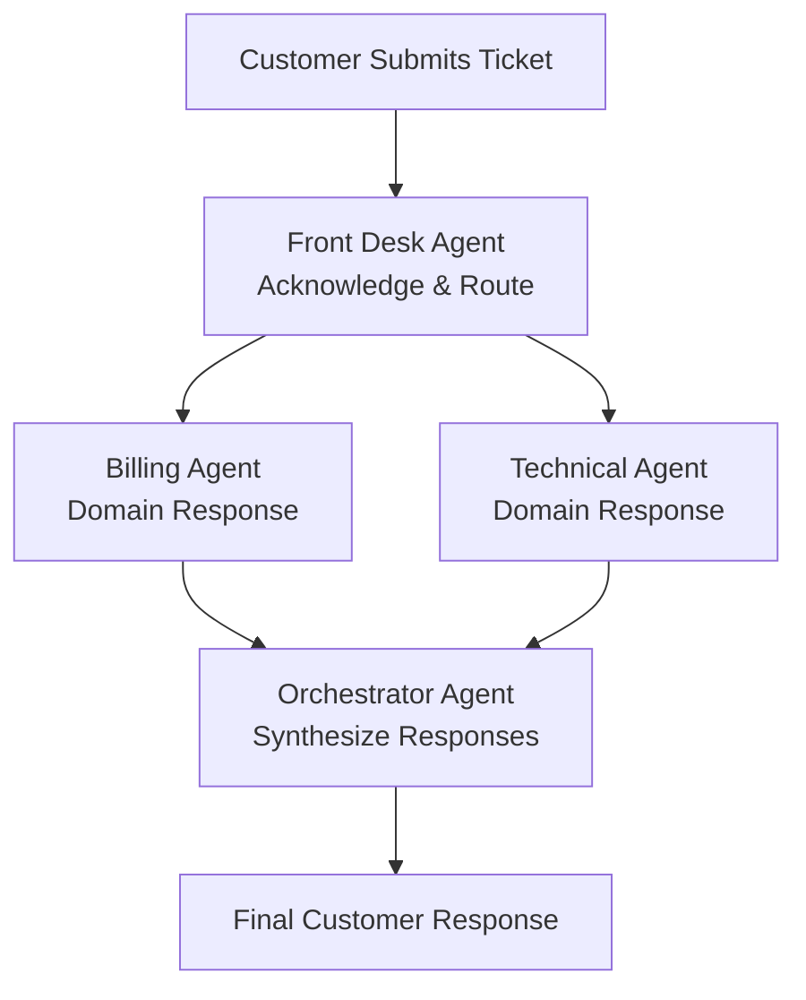

# A2A Customer Service

This code demonstrates a multi-agent customer service system built with the A2A (Agent2Agent) Protocol 0.3.0 and the a2a .NET SDK. It showcases how to orchestrate multiple specialised AI agents Front Desk, Billing, Technical, and Orchestrator to deliver coordinated, high-quality support responses. The backend is built with ASP.NET Core and Semantic Kernel (Azure OpenAI), while the frontend is a React app.

This implementation is fully compliant with A2A Protocol 0.3.0 specifications, featuring multiple transport protocols (JSON-RPC and HTTP+JSON), agent discovery via well-known endpoints, and comprehensive Agent Cards with detailed skill declarations.

Check out my [A2A blog](https://arafattehsin.com/building-agent-to-agent-a2a-communication-for-smarter-ai-systems/) to learn about how I did it as well as how it goes with Model Context Protocol (MCP).


---

## Table of Contents

- [Overview](#overview)
- [Architecture](#architecture)
- [Backend Setup](#backend-setup)
- [Frontend Setup](#frontend-setup)
- [How It Works](#how-it-works)
- [Switching Between Mock and Real LLM](#switching-between-mock-and-real-llm)
- [Extending the app](#extending-the-app)
- [References](#references)

---

## Overview

The A2A Protocol is an open standard for agent-to-agent communication, enabling AI agents to collaborate and exchange structured messages across different platforms and technologies. The a2a .NET SDK implements this protocol for C# developers, providing primitives such as `TaskManager`, message contracts, and ASP.NET Core bindings. This makes it possible to expose agents as HTTP endpoints and compose them into sophisticated workflows, all while maintaining interoperability and clarity of responsibility.

---

## Architecture

- **Backend** (`backend/`):
  - ASP.NET Core Web API
  - Implements four main agents: Front Desk, Billing, Technical, Orchestrator
  - Uses Semantic Kernel for LLM integration (Azure OpenAI)
  - Exposes REST API and A2A agent endpoints
  - Supports both mock and real LLM modes
- **Frontend** (`frontend/`):
  - React app (Vite + TypeScript)
  - Communicates with backend via REST API
  - Allows ticket submission, agent status viewing, and progress tracking

### Agent Orchestration Flow



---

## Backend Setup

1. **Prerequisites:**

   - .NET 8 or 9 SDK
   - (Optional) Azure OpenAI credentials for real LLM mode

2. **Install dependencies and run:**

   ```powershell
   cd backend
   dotnet restore
   dotnet run
   ```

3. **Configuration:**

   - By default, runs in mock mode (no Azure OpenAI required).
   - To enable real LLM mode, set these environment variables:
     - `AOI_ENDPOINT_SWDN` (Azure OpenAI endpoint)
     - `AOI_KEY_SWDN` (Azure OpenAI key)
     - Optionally, set `AzureOpenAI:DeploymentName` in `appsettings.json` (defaults to `gpt-4o`).

4. **A2A Protocol Endpoints:**
   - Agent discovery: `GET /api/a2a/agents`
   - Agent Cards (well-known endpoints):
     - Front Desk: `GET /frontdesk/.well-known/agent.json`
     - Billing: `GET /billing/.well-known/agent.json`
     - Technical: `GET /technical/.well-known/agent.json`
     - Orchestrator: `GET /orchestrator/.well-known/agent.json`
   - JSON-RPC endpoints: `POST /frontdesk`, `/billing`, `/technical`, `/orchestrator`
   - HTTP+JSON endpoints: `POST /frontdesk/v1/message:send`, `/billing/v1/message:send`, etc.

---

## A2A Protocol 0.3.0 Features

This implementation includes all key features of A2A Protocol 0.3.0:

### Transport Support

- **JSON-RPC 2.0**: Primary transport protocol for all agents
- **HTTP+JSON**: RESTful endpoints for modern API integration
- **Multiple Interfaces**: Each agent supports both transport methods

### Agent Discovery

- **Well-Known Endpoints**: Standard `/.well-known/agent.json` discovery
- **Agent Cards**: Comprehensive metadata including skills, capabilities, and transport options
- **Protocol Version**: Declares compatibility with A2A 0.3.0

### Agent Capabilities

Each agent publishes detailed capabilities through their Agent Cards:

#### Front Desk Agent

- **Skills**: acknowledge_request, route_to_specialist, customer_greeting
- **Role**: Initial contact, routing, and coordination

#### Billing Agent

- **Skills**: process_refund, explain_charges, resolve_payment_issue, account_inquiry
- **Role**: Payment and account-related support

#### Technical Agent

- **Skills**: diagnose_issue, troubleshoot, provide_guidance, system_explanation
- **Role**: Technical support and problem resolution

#### Orchestrator Agent

- **Skills**: synthesize_responses, coordinate_agents, escalate_ticket, finalize_response
- **Role**: Multi-agent coordination and response synthesis

---

## Frontend Setup

1. **Prerequisites:**

   - Node.js (LTS)

2. **Install dependencies and run:**

   ```powershell
   cd frontend
   npm install
   npm run dev
   ```

3. **Configuration:**
   - The frontend expects the backend at `http://localhost:5000` (see `src/services/api.ts`).
   - If you change backend ports, update the API base URL accordingly.

---

## How It Works

1. **Ticket Submission:**

   - User submits a ticket via the frontend.
   - Backend assigns priority and starts processing.

2. **Three-Layer Agent Pipeline:**

   - **Layer 1:** Front Desk agent acknowledges and routes the ticket.
   - **Layer 2:** Billing and/or Technical agents process the ticket based on content.
   - **Layer 3:** Orchestrator agent synthesizes specialist responses into a final message.

3. **Status Tracking:**
   - Ticket and agent statuses are available via the API and shown in the frontend.

---

## Switching Between Mock and Real LLM

- **Default:** Mock mode (no Azure OpenAI required).
- **To enable real LLM mode:**
  - Set `AOI_ENDPOINT_SWDN` and `AOI_KEY_SWDN` as environment variables.
  - Use the `/toggle-implementation` endpoint or the frontend toggle (if available).
- **Check current mode:**
  - `GET /api/customerservice/status`

---

## Extending the App

- **Add new agents:**
  - Clone the `BaseA2AAgent` pattern in `Services/Agents/A2AAgents.cs`.
  - Register and map a new A2A endpoint in `Program.cs`.
- **Tune prompts:**
  - Edit agent-specific prompts for your domain in `A2AAgents.cs`.
- **Swap LLMs:**
  - Implement the `ILLMService` interface for other LLM providers.
- **Persist tickets:**
  - Replace in-memory storage in `A2ATicketService` with a database.
- **Add streaming updates:**
  - Use SignalR or WebSockets for real-time progress.

---

## References

- [A2A Protocol](https://a2aprotocol.ai)
- [a2a .NET SDK](https://github.com/a2aproject/a2a-dotnet)
- [Semantic Kernel](https://github.com/microsoft/semantic-kernel)
- [Azure AI Foundry Blog: Building AI Agents with the A2A .NET SDK](https://devblogs.microsoft.com/foundry/building-ai-agents-a2a-dotnet-sdk/)

---

For questions or contributions, please open an issue or pull request.
